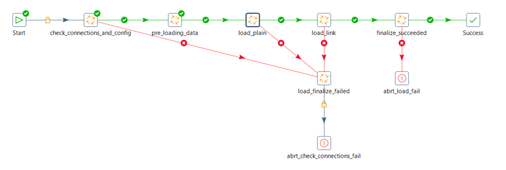

| Entregable | Proyecto ETL                                                 |
| ---------- | ------------------------------------------------------------ |
| Fecha      | 17/12/2020                                                   |
| Proyecto   | [ASIO](https://www.um.es/web/hercules/proyectos/asio) (Arquitectura Semántica e Infraestructura Ontológica) en el marco de la iniciativa [Hércules](https://www.um.es/web/hercules/) para la Semántica de Datos de Investigación de Universidades que forma parte de [CRUE-TIC](https://www.crue.org/proyecto/hercules/) |
| Módulo     | Proyecto ETL                                                 |
| Tipo       | Documentación Técnica                                        |

# Documentación Técnica

Este documento explica el proceso para desarrollar el ETL, desde la importación de los datos de origen hasta la generación de los datos de salida

## Orígenes

Se precisa importar los datos de la base de datos de origen en formato tabular, que hacen referencia a las distintas entidades que se pretende manipular y modelar. Estas entidades se encuentran reflejadas en el documento de Mapeo Origenes-Ontología, donde además se establece su equivalencia con las entidades que define la ontología. 

Entidades: 

| Entidades     | Orígenes                                             |
| -------------- | ------------------------------------------------------------ |
| Proyecto          | Proyecto, FechaProyecto, RelacionOrigenProyecto,FinanciacionProyecto, TipoFinanciacion |
| GrupoInvestigacion       | GrupoInvestigacion |
| Persona         |  Persona                                               |
| Patente           |    Patente                                                  |
| Factura       | FacturaProyecto |
| Universidad         |   (generación manual)                                    |
| Articulo         |     Artículo                                  |
| Libro         |   Libro                                    |

## Jobs y Transformations

El ETL se estructura en Jobs y en Transformaciones. Un Job es una secuencia de distintas Transformaciones, mientras que una Transformación comprende una serie de pasos que se ejecutan en paralelo, desde uno o varios orígenes de datos hasta su correspondiente salida o salidas.

Lista de Jobs del ETL

| Job     | Descripción                                             |
| -------------- | ------------------------------------------------------------ |
| main          |Job principal para ejecutar el ETL al completo |
| CheckConnectionsAndControl       |Contro de estado de las conexiones a bases de datos|
| Main Load Plain         |  Ejecución y carga de todas las entidades sin relaciones                                               |
| Plain Entity Project           | Ejecución de las transformaciones de entidades de tipo Proyecto                                                     |
| Plain Entity Document       | Ejecución de las transformaciones de las entidades de tipo Documento |
| Plain Entity Agent         |   Ejecución de las transformaciones de las entidades de tipo Agente                                    |
| Main Load Linked         |   Ejecución y carga de todas las entidades con relaciones                                    |
| Link Entity Project         |  Ejecución de las transformaciones de entidades de tipo Proyecto                                      |
| Link Entity Document         | Ejecución de las transformaciones de las entidades de tipo Documento                                      |
| Link Entity Agent         |  Ejecución de las transformaciones de las entidades de tipo Agente                                      |
| Finalize Suceeded         |  Ejecución de la transformación de control de ejecución exitosa                                     |
| Finalize Failed         |  Ejecución de la transformación de control de ejecución fallida                                     |

Lista de Transformaciones del ETL

| Transformacion     | Descripción                                             |
| -------------- | ------------------------------------------------------------ |
| Control DB Source          |Control conexión con base de datos origen |
| Control DB Target       |Control conexión con base de datos destino |
| Project         |  Extracción transformación y carga de la entidad Proyecto        |
| Invoice           | Extracción transformación y carga de la entidad Factura                                            |
| Patent       | Extracción transformación y carga de la entidad Patente |
| Article         |   Extracción transformación y carga de la entidad Artículo                                    |
| Book         |   Extracción transformación y carga de la entidad Libro                                |
| Person         |  Extracción transformación y carga de la entidad Persona                               |
| Research Group         | Extracción transformación y carga de la entidad GrupoInvestigacion                                     |
| University         |  Extracción transformación y carga de la entidad Universidad                                     |
| Project_Link         |  Extracción transformación y carga de la entidad Proyecto con relaciones                           |
| Patent_Link       |  Extracción transformación y carga de la entidad Patente con relaciones  |
| Article_Link       |  Extracción transformación y carga de la entidad Articulo con relaciones  |
| Book_Link       | Extracción transformación y carga de la entidad Libro con relaciones  |
| ResearchGroup_Link       |  Extracción transformación y carga de la entidad GrupoInvestigacion con relaciones  |
| Intermediate_Tables       |  Extracción transformación y carga de las tablas intermedias del modelo de datos  |


## Datos de Salida

El proceso ETL debe de tener la capacidad para generar la salida de datos en el formato adecuado. La estructura JSON responde a los siguientes dos tipos de formato, uno de ellos para las entidades simples:
```json
{
"operation":"INSERT/UPDATE/DELETE",
"data":
	{
    "@class":"class_name",
    "id":"class_id",
    "prop_name_1":"prop_value_1",
    "prop_name_2":"prop_value_2",
    "prop_name_3":"prop_value_3",
    "prop_name_N":"prop_value_N",
   }
}	
```
y otro para las entidades con relaciones:
```json
{
"operation":"LINKED_INSERT/UPDATE/DELETE",
"data":
	{
	"linkedModel": 
		{
			"@class":"parent_class_name",
			"id":"parent_class_id",
			"linkedTo":
			[
				{
					"className":"child_class_name_1",
                    "fieldName":"child_field_name_1",
                    "ids":[child_class1_id1..child_class1_idN]
                },
                {
                    "className":"child_class_name_2",
                    "fieldName":"child_field_name_2",
                    "ids":[child_class2_id1..child_class2_idN]
                },               
                {
                    "className":"child_class_name_N",
                    "fieldName":"child_field_name_N",
                    "ids":[child_classN_id1..child_classN_idN]
                }
			]
		}
	}
}
```
## Estructura de transformaciones

Las Transformaciones para cada una de las entidades procesadas, responde a una estructura similar que se detalla a continuación:


Cada transformación se centra en una entidad en particular y se siguen los siguientes pasos:

Entidades sin relación:

- Se leen los distintos orígenes implicados en cada transformación: la entidad principal y todos aquellos orígenes que contengan datos relacionados con la entidad principal y que consistan en propiedades de la entidad.

- Una vez extraídos los datos se eliminan los caracteres extraños en todos aquellos campos que lo precisen, se seleccionan únicamente los datos que sean necesarios y se añaden campos de tipo constante (si procede). Se realiza una ordenación sobre el campo identificador de la entidad principal y se efectúan las uniones y agregaciones que sean necesarias.

- Una vez que los datos se encuentran unificados se realiza un último filtrado con el objetivo de limpiar el dataset resultante.

- Se realiza una carga en la DB "ETL" donde se almacenarán los datos de la entidad en cuestión y todas sus propiedades

- Se compone el cuerpo y estructura del formato de salida, teniendo en cuenta el patrón descrito anteriormente

- Se cargan los datos en formato JSON en la cola de Kafka correspondiente a los objetos sin relaciones.


Entidades con relación:

- Se cargan los correspondientes a la entidad tradada, desde la base de datos ETL donde se almacena la entidad y sus propiedades. 
- Se cargan los datos correspondientes a las relaciones, los cuales pueden proceder de otras entidades o de tablas intermedias.

- Una vez extraídos los datos se eliminan los caracteres extraños en todos aquellos campos que lo precisen, se seleccionan únicamente los datos que sean necesarios y se añaden campos de tipo constante (si procede). Se realiza una ordenación sobre el campo identificador de la entidad principal y se efectúan las uniones y agregaciones que sean necesarias.

- Una vez que los datos se encuentran unificados se realiza un último filtrado con el objetivo de limpiar el conjunto de datos resultante.

- Se compone el cuerpo y estructura del formato de salida, teniendo en cuenta el patrón descrito anteriormente para las entidades con relaciones.

- Se cargan los datos en formato JSON en la cola de Kafka correspondiente a los objetos con relaciones

## Proceso ETL

Proceso ETL completo: a continuación se detalla el proceso de ETL completo sirviéndose de la entidad Proyecto como ejemplo. Este proceso es extrapolable a cualquier otra entidad (sobreentendiendo las particularidades que tendrá cada entidad en su transformación correspondiente)

1. Se ejecuta la llamada al proceso a través la URL: http://localhost:8080/kettle/runJob/?job=main&version=[Identificador de la versión], donde [Identificador de la versión] contendrá el valor de la versión a ejecutar.

2. El proceso ETL comienza con la ejecución del job "main
    

3. Se ejecuta el control de estado de bases de datos

   

4. Seguidamente se ejecuta el job que controla todas las entidades. Este job está formado por diversos jobs que se corresponden con las clases maestras definidas en la ontología.  

   

5. Para el caso de la entidad Proyecto, se dispone de un job específico que controla todas aquellas entidades y sub-entidades que se encuentran englobadas dentro de Proyecto

   

6. Finalmente se ejecuta la transformación que se encarga de importar los datos de los distintos orígenes implicados, realizar las transformaciones oportunas y componer el objeto de salida en el formato especificado


Se muestra un ejemplo de objeto plano de tipo Proyecto, sin relaciones

```json
{
    "operation":"INSERT",
    "data":
    {
        "tipo":"AYUDA",
        "@class":"Proyecto",
        "fund":"SUBVENCIÓN",
        "name":"ECONOMIA SOCIAL EN  2013",
        "start":"2013-01-01",
        "end":"2013-12-31",
        "id":16823
    }
}	
```

7. Una vez que se han terminado de generar todos los objetos planos de las distintas entidades, se ejecuta la transformación "Intermediate_Tables" donde se realiza una carga en la base de datos "ETL" de todas las tablas de relación, que serán necesaria para generar los objetos de relación (entidades con relaciones)

   

8. El siguiente paso será ejecutar el Job que controla todas las entidades con relaciones


9. Analizando el caso para la entidad Proyecto, vemos como se disponen los distintos Jobs hasta llegar a la transformación en cuestión


Transformación entidad proyecto con relaciones


Se muestra un ejemplo de objeto plano de tipo Proyecto, con relaciones

```json
{
  "operation": "LINKED_INSERT",
  "data": {
    "linkedModel": {
      "@class": "Proyecto",
      "id": "186",
      "linkedTo": [
        {
          "className": "GrupoInvestigacion",
          "fieldName": "grupo",
          "ids": [
            "E0C5-01"
          ]
        },
        {
          "className": "Factura",
          "fieldName": "fact",
          "ids": []
        },
        {
          "className": "Persona",
          "fieldName": "pers",
          "ids": [
            "7459",
            "5555",
            "5555",
            "2819",
            "7921"
          ]
        }
      ]
    }
  }
}
```

## Control de errores

La ETL tiene varios controles de error distribuídos a lo largo de todo el proceso:

1. Control de finalización exitosa o fallida del proceso de carga. Se almacenarán los valores 2 o 3 en la tabla ControlEjecucion:
        2. Succesfully completed
        3. Failed

2. Control de finalización de las transformaciones. Se almacenará en el fichero de logs un mensaje en caso de ejecución fallida de cada una de las transformaciones.