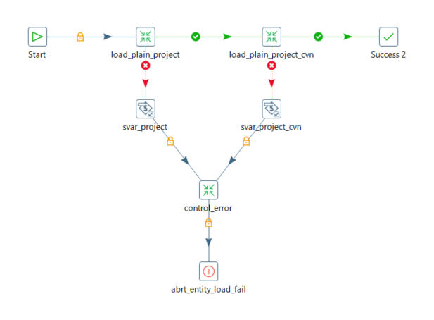
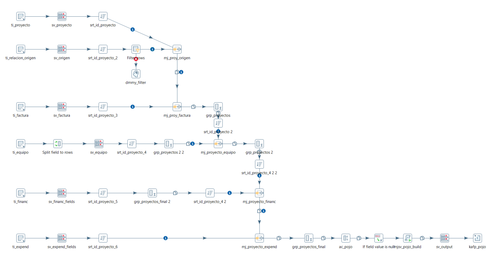

| Entregable | Proyecto ETL                                                 |
| ---------- | ------------------------------------------------------------ |
| Fecha      | 15/07/2021                                                   |
| Proyecto   | [ASIO](https://www.um.es/web/hercules/proyectos/asio) (Arquitectura Semántica e Infraestructura Ontológica) en el marco de la iniciativa [Hércules](https://www.um.es/web/hercules/) para la Semántica de Datos de Investigación de Universidades que forma parte de [CRUE-TIC](https://www.crue.org/proyecto/hercules/) |
| Módulo     | Proyecto ETL                                                 |
| Tipo       | Documentación Técnica                                        |

# Documentación Técnica

Este documento explica el proceso para desarrollar el ETL, desde la importación de los datos de origen hasta la generación de los datos de salida

## Orígenes

Se precisa importar los datos de la base de datos de origen en formato tabular, que hacen referencia a las distintas entidades que se pretende manipular y modelar. Estas entidades se encuentran reflejadas en el documento de Mapeo Origenes-Ontología, donde además se establece su equivalencia con las entidades que define la ontología. 

Entidades: 

| Orígenes                                             |
| ------------------------------------------------------------ |
| SGI         |
|CVN                                    |

## Jobs y Transformations

El ETL se estructura en Jobs y en Transformaciones. Un Job es una secuencia de distintas Transformaciones, mientras que una Transformación comprende una serie de pasos que se ejecutan en paralelo, desde uno o varios orígenes de datos hasta su correspondiente salida o salidas.

Lista de Jobs del ETL

| Job     | Descripción                                             |
| :------------- | ------------------------------------------------------------ |
| main          |Job principal para ejecutar el ETL al completo |
| CheckConnectionsAndControl       |Control de estado de las conexiones a bases de datos|
| load_plain |  Ejecución y carga de todas las entidades sin relaciones                                               |
| load_plain_accreditation | Ejecución de las transformaciones de entidades de tipo Acreditación                                         |
| load_plain_feature | Ejecución de las transformaciones de las entidades de tipo Característica |
| load_plain_concept_scheme |   Ejecución de las transformaciones de las entidades de tipo Concept Scheme (skos)                |
| load_plain_project |   Ejecución y carga de todas las entidades de tipo Proyecto                     |
| load_plain_information_content      |  Ejecución de las transformaciones de entidades de Contenido de Información               |
| load_plain_publication              | Ejecución y carga de todas las entidades de tipo Publicación |
| load_plain_collection               | Ejecución y carga de todas las entidades de tipo Colección |
| load_plain_agent                    | Ejecución de las transformaciones de entidades de Agente     |
| load_plain_group                    | Ejecución de las transformaciones de entidades de tipo Grupo |
| load_plain_organization             | Ejecución de las transformaciones de entidades de tipo Organización |
| load_plain_person                   | Ejecución de las transformaciones de entidades de tipo Persona |
| load_plain_activity                 | Ejecución de las transformaciones de entidades de tipo Actividad |
| load_plain_funding                  | Ejecución de las transformaciones de entidades de tipo Financiación |
| load_plain_expense                  | Ejecución de las transformaciones de entidades de tipo Gasto |
| load_plain_role | Ejecución de las transformaciones de entidades de tipo Gasto |
| load_plain_relationship | Ejecución de las transformaciones de entidades de tipo Relación |
| load_plain_contract | Ejecución de las transformaciones de entidades de tipo Contrato |
| load_plain_awarded_degree | Ejecución de las transformaciones de entidades de tipo Titulación Universitaria Concedida |
| load_plain_supervising_relationship | Ejecución de las transformaciones de entidades de tipo Relación de Supervisión |
| load_plain_position | Ejecución de las transformaciones de entidades de tipo Posición |
| load_plain_research_field | Ejecución de las transformaciones de entidades de tipo Campo de Investigación |
| load_plain_keyword | Ejecución de las transformaciones de entidades de tipo Palabra Clave |
| load_plain_academic_degree | Ejecución de las transformaciones de entidades de tipo Título Académico |
| load_plain_funding_program | Ejecución de las transformaciones de entidades de tipo Programa de Financiación |
| Finalize Suceeded | Ejecución de la transformación de control de ejecución exitosa |
| Finalize Failed | Ejecución de la transformación de control de ejecución fallida |


Lista de Transformaciones del ETL

| Transformación     | Descripción                                             |
| -------------- | ------------------------------------------------------------ |
| Control DB Source          |Control conexión con base de datos origen |
| Control DB Target       |Control conexión con base de datos destino |
|5.1.0_knowledge_area_mapping.ktr|Carga mapeo de Areas de Conocimiento con Grupos de Investigación|
|5.1.10_load_plain_doctoral_thesis.ktr|Extracción transformación y carga de la entidad DOCTORAL THESIS |
|5.1.12_load_plain_conference.ktr|Extracción transformación y carga de la entidad CONFERENCE  |
|5.1.13_load_plain_exhibit.ktr|Extracción transformación y carga de la entidad EXHIBIT  |
|5.1.14_load_plain_tipo_financiacion.ktr|Extracción transformación y carga de la entidad TIPO FINANCIACION |
|5.1.15_load_plain_fuente_financiacion.ktr|Extracción transformación y carga de la entidad FUENTE FINANCIACION |
|5.1.16_load_plain_dossier.ktr|Extracción transformación y carga de la entidad DOSSIER  |
|5.1.17_load_plain_project_expense.ktr|Extracción transformación y carga de la entidad PROJECT EXPENSE |
|5.1.18_load_plain_patent_expense.ktr|Extracción transformación y carga de la entidad PATENT EXPENSE |
|5.1.19_load_plain_pantent_asignee.ktr|Extracción transformación y carga de la entidad PANTENT ASIGNEE |
|5.1.1_load_plain_proyecto.ktr|Extracción transformación y carga de la entidad PROYECTO  |
|5.1.20_load_plain_research_accreditation.ktr|Extracción transformación y carga de la entidad RESEARCH ACCREDITATION |
|5.1.21_load_plain_editor_role.ktr|Extracción transformación y carga de la entidad EDITOR ROLE |
|5.1.21_load_plain_supervisor_role.ktr|Extracción transformación y carga de la entidad SUPERVISOR ROLE |
|5.1.22_load_plain_project_contract.ktr|Extracción transformación y carga de la entidad PROJECT CONTRACT |
|5.1.23_load_plain_member_role.ktr|Extracción transformación y carga de la entidad MEMBER ROLE |
|5.1.24_load_plain_employment_contract.ktr|Extracción transformación y carga de la entidad EMPLOYMENT CONTRACT |
|5.1.25_load_plain_research_field.ktr|Extracción transformación y carga de la entidad RESEARCH FIELD |
|5.1.26_load_plain_internship.ktr|Extracción transformación y carga de la entidad INTERNSHIP  |
|5.1.28_load_plain_researcher_role.ktr|Extracción transformación y carga de la entidad RESEARCHER ROLE |
|5.1.29_load_plain_group.ktr|Extracción transformación y carga de la entidad GROUP  |
|5.1.30_load_plain_keyword.ktr|Extracción transformación y carga de la entidad KEYWORD  |
|5.1.31_load_plain_concept.ktr|Extracción transformación y carga de la entidad CONCEPT  |
|5.1.32_load_plain_pantent_owner.ktr|Extracción transformación y carga de la entidad PANTENT OWNER |
|5.1.33_load_plain_researcher_position.ktr|Extracción transformación y carga de la entidad RESEARCHER POSITION |
|5.1.34_load_plain_phd_supervising_relationship.ktr|Extracción transformación y carga de la entidad PHD SUPERVISING RELATIONSHIP|
|5.1.35_cvn_load_plain_knowledge_area.ktr|Extracción transformación y carga de la entidad PLAIN KNOWLEDGE AREA|
|5.1.3_load_plain_patente.ktr|Extracción transformación y carga de la entidad PATENTE  |
|5.1.4_load_plain_universidad.ktr|Extracción transformación y carga de la entidad UNIVERSIDAD  |
|5.1.5_load_plain_grupo_investigacion.ktr|Extracción transformación y carga de la entidad GRUPO INVESTIGACION |
|5.1.6_load_plain_factura.ktr|Extracción transformación y carga de la entidad FACTURA  |
|5.1.7_load_plain_articulo.ktr|Extracción transformación y carga de la entidad ARTICULO  |
|5.1.8_load_plain_libro.ktr|Extracción transformación y carga de la entidad LIBRO  |
|5.1.9_load_plain_person.ktr|Extracción transformación y carga de la entidad PERSON  |
|5.2.10_load_link_exposicion.ktr|Extracción transformación y carga de las relaciones de la entidad EXPOSICION  |
|5.2.11_load_link_design.ktr|Extracción transformación y carga de las relaciones de la entidad DESIGN  |
|5.2.12_load_link_editor_role.ktr|Extracción transformación y carga de las relaciones de la entidad EDITOR ROLE |
|5.2.13_load_link_internship.ktr|Extracción transformación y carga de las relaciones de la entidad INTERNSHIP  |
|5.2.14_load_link_member_role.ktr|Extracción transformación y carga de las relaciones de la entidad MEMBER ROLE |
|5.2.15_load_link_supervisor_role.ktr|Extracción transformación y carga de las relaciones de la entidad SUPERVISOR ROLE |
|5.2.16_load_link_researcher_role.ktr|Extracción transformación y carga de las relaciones de la entidad RESEARCHER ROLE |
|5.2.18_load_link_project_contract.ktr|Extracción transformación y carga de las relaciones de la entidad PROJECT CONTRACT |
|5.2.19_load_link_employment_contract.ktr|Extracción transformación y carga de las relaciones de la entidad EMPLOYMENT CONTRACT |
|5.2.1_load_link_proyecto.ktr|Extracción transformación y carga de las relaciones de la entidad PROYECTO  |
|5.2.20_load_link_accreditation.ktr|Extracción transformación y carga de las relaciones de la entidad ACCREDITATION  |
|5.2.21_load_link_university.ktr|Extracción transformación y carga de las relaciones de la entidad UNIVERSITY  |
|5.2.2_load_link_patente.ktr|Extracción transformación y carga de las relaciones de la entidad PATENTE  |
|5.2.33_load_link_researcher_position.ktr|Extracción transformación y carga de las relaciones de la entidad RESEARCHER POSITION |
|5.2.34_load_link_phd_supervising_relationship.ktr|Extracción transformación y carga de las relaciones de la entidad PHD SUPERVISING RELATIONSHIP|
|5.2.3_load_link_grupo_investigacion.ktr|Extracción transformación y carga de las relaciones de la entidad GRUPO INVESTIGACION |
|5.2.4_load_link_articulo.ktr|Extracción transformación y carga de las relaciones de la entidad ARTICULO  |
|5.2.5_load_link_libro.ktr|Extracción transformación y carga de las relaciones de la entidad LIBRO  |
|5.2.6_load_link_proyecto_internacional.ktr|Extracción transformación y carga de las relaciones de la entidad PROYECTO INTERNACIONAL |
|5.2.7_load_link_doctoral_thesis.ktr|Extracción transformación y carga de las relaciones de la entidad DOCTORAL THESIS |
|5.2.9_load_link_congreso.ktr|Extracción transformación y carga de las relaciones de la entidad CONGRESO  |
|5.3.00_cvn_code_mapping.ktr|Carga mapeo de códigos del estándar CVN MAPPING  |
|5.3.01_cvn_load_plain_curriculum_vitae.ktr|Extracción transformación y carga de la entidad CVN CURRICULUM VITAE |
|5.3.02_cvn_load_plain_project.ktr|Extracción transformación y carga de la entidad CVN PROJECT  |
|5.3.03_cvn_load_plain_book.ktr|Extracción transformación y carga de la entidad CVN BOOK  |
|5.3.04_cvn_load_plain_doctoral_thesis.ktr|Extracción transformación y carga de la entidad CVN DOCTORAL THESIS |
|5.3.05_cvn_load_plain_person.ktr|Extracción transformación y carga de la entidad CVN PERSON  |
|5.3.06_cvn_load_plain_funding_organization.ktr|Extracción transformación y carga de la entidad CVN FUNDING ORGANIZATION |
|5.3.07_cvn_load_plain_patent.ktr|Extracción transformación y carga de la entidad CVN PATENT  |
|5.3.08_cvn_load_plain_research_group.ktr|Extracción transformación y carga de la entidad CVN RESEARCH GROUP |
|5.3.09_cvn_load_plain_academic_degree.ktr|Extracción transformación y carga de la entidad CVN ACADEMIC DEGREE |
|5.3.10_cvn_load_plain_funding_program.ktr|Extracción transformación y carga de la entidad CVN FUNDING PROGRAM |
|5.3.11_cvn_load_plain_awarded_degree.ktr|Extracción transformación y carga de la entidad CVN AWARDED DEGREE |
|5.3.12_cvn_load_plain_publication.ktr|Extracción transformación y carga de la entidad CVN PUBLICATION  |
|5.3.13_cvn_load_plain_conference.ktr|Extracción transformación y carga de la entidad CVN CONFERENCE  |
|5.3.14_cvn_load_plain_researcher_position.ktr|Extracción transformación y carga de la entidad CVN RESEARCHER POSITION |
|5.3.15_cvn_load_plain_phd_supervising_relationship.ktr|Extracción transformación y carga de la entidad CVN PHD SUPERVISING RELATIONSHIP|
|5.3.16_cvn_load_plain_principal_investigator_role.ktr|Extracción transformación y carga de la entidad CVN PRINCIPAL INVESTIGATOR ROLE|
|5.3.17_cvn_load_plain_phd_supervisee_role.ktr|Extracción transformación y carga de la entidad CVN PHD SUPERVISEE ROLE|
|5.3.18_cvn_load_plain_activity.ktr|Extracción transformación y carga de la entidad CVN ACTIVITY  |
|5.3.19_cvn_load_plain_feature.ktr|Extracción transformación y carga de la entidad CVN FEATURE  |
|5.3.20_cvn_load_plain_academic_subject.ktr|Extracción transformación y carga de la entidad CVN ACADEMIC SUBJECT |
|5.4.02_cvn_load_link_project.ktr|Extracción transformación y carga de relaciones de la entidad PROJECT  |
|5.4.03_cvn_load_link_book.ktr|Extracción transformación y carga de relaciones de la entidad BOOK  |
|5.4.04_cvn_load_link_doctoral_thesis.ktr|Extracción transformación y carga de relaciones de la entidad DOCTORAL THESIS |
|5.4.05_cvn_load_link_person.ktr|Extracción transformación y carga de relaciones de la entidad PERSON  |
|5.4.06_cvn_load_link_funding_organization.ktr|Extracción transformación y carga de relaciones de la entidad FUNDING ORGANIZATION |
|5.4.07_cvn_load_link_patent.ktr|Extracción transformación y carga de relaciones de la entidad PATENT  |
|5.4.08_cvn_load_link_research_group.ktr|Extracción transformación y carga de relaciones de la entidad RESEARCH GROUP |
|5.4.10_cvn_load_link_funding_program.ktr|Extracción transformación y carga de relaciones de la entidad FUNDING PROGRAM |
|5.4.11_cvn_load_link_awarded_degree.ktr|Extracción transformación y carga de relaciones de la entidad AWARDED DEGREE |
|5.4.12_cvn_load_link_publication.ktr|Extracción transformación y carga de relaciones de la entidad PUBLICATION  |
|5.4.13_cvn_load_link_conference.ktr|Extracción transformación y carga de relaciones de la entidad CONFERENCE  |
|5.4.14_cvn_load_link_researcher_position.ktr|Extracción transformación y carga de relaciones de la entidad RESEARCHER POSITION |
|5.4.15_cvn_load_link_phd_supervising_relationship.ktr|Extracción transformación y carga de relaciones de la entidad PHD SUPERVISING RELATIONSHIP|
|5.4.16_cvn_load_link_principal_investigator_role.ktr|Extracción transformación y carga de relaciones de la entidad PRINCIPAL INVESTIGATOR ROLE|
|5.4.17_cvn_load_link_supervisee_role.ktr|Extracción transformación y carga de relaciones de la entidad SUPERVISEE ROLE |
|5.4.18_cvn_load_link_activity.ktr|Extracción transformación y carga de relaciones de la entidad ACTIVITY  |
|load_relational_tables.ktr|Carga de tablas de relacion |


## Datos de Salida

El proceso ETL debe de tener la capacidad para generar la salida de datos en el formato adecuado. La estructura JSON responde a los siguientes dos tipos de formato, uno de ellos para las entidades simples:
```json
{
"operation":"INSERT/UPDATE/DELETE",
"data":
	{
    "@class":"class_name",
    "id":"class_id",
    "prop_name_1":"prop_value_1",
    "prop_name_2":"prop_value_2",
    "prop_name_3":"prop_value_3",
    "prop_name_N":"prop_value_N",
   }
}	
```
y otro para las entidades con relaciones:
```json
{
"operation":"LINKED_INSERT/UPDATE/DELETE",
"data":
	{
	"linkedModel": 
		{
			"@class":"parent_class_name",
			"id":"parent_class_id",
			"linkedTo":
			[
				{
					"className":"child_class_name_1",
                    "fieldName":"child_field_name_1",
                    "ids":[child_class1_id1..child_class1_idN]
                },
                {
                    "className":"child_class_name_2",
                    "fieldName":"child_field_name_2",
                    "ids":[child_class2_id1..child_class2_idN]
                },               
                {
                    "className":"child_class_name_N",
                    "fieldName":"child_field_name_N",
                    "ids":[child_classN_id1..child_classN_idN]
                }
			]
		}
	}
}
```
## Estructura de transformaciones

Las Transformaciones para cada una de las entidades procesadas, responde a una estructura similar que se detalla a continuación:


Cada transformación se centra en una entidad en particular y se siguen los siguientes pasos:

Entidades sin relación:

- Se leen los distintos orígenes implicados en cada transformación: la entidad principal y todos aquellos orígenes que contengan datos relacionados con la entidad principal y que consistan en propiedades de la entidad.

- Una vez extraídos los datos se eliminan los caracteres extraños en todos aquellos campos que lo precisen, se seleccionan únicamente los datos que sean necesarios y se añaden campos de tipo constante (si procede). Se realiza una ordenación sobre el campo identificador de la entidad principal y se efectúan las uniones y agregaciones que sean necesarias.

- Una vez que los datos se encuentran unificados se realiza un último filtrado con el objetivo de limpiar el dataset resultante.

- Se realiza una carga en la DB "ETL" donde se almacenarán los datos de la entidad en cuestión y todas sus propiedades

- Se compone el cuerpo y estructura del formato de salida, teniendo en cuenta el patrón descrito anteriormente

- Se cargan los datos en formato JSON en la cola de Kafka correspondiente a los objetos sin relaciones.


Entidades con relación:

- Se cargan los correspondientes a la entidad tradada, desde la base de datos ETL donde se almacena la entidad y sus propiedades. 
- Se cargan los datos correspondientes a las relaciones, los cuales pueden proceder de otras entidades o de tablas intermedias.

- Una vez extraídos los datos se eliminan los caracteres extraños en todos aquellos campos que lo precisen, se seleccionan únicamente los datos que sean necesarios y se añaden campos de tipo constante (si procede). Se realiza una ordenación sobre el campo identificador de la entidad principal y se efectúan las uniones y agregaciones que sean necesarias.

- Una vez que los datos se encuentran unificados se realiza un último filtrado con el objetivo de limpiar el conjunto de datos resultante.

- Se compone el cuerpo y estructura del formato de salida, teniendo en cuenta el patrón descrito anteriormente para las entidades con relaciones.

- Se cargan los datos en formato JSON en la cola de Kafka correspondiente a los objetos con relaciones

## Proceso ETL

Proceso ETL completo: a continuación se detalla el proceso de ETL completo sirviéndose de la entidad Proyecto como ejemplo. Este proceso es extrapolable a cualquier otra entidad (sobreentendiendo las particularidades que tendrá cada entidad en su transformación correspondiente)

1. Se ejecuta la llamada al proceso a través la URL: http://localhost:8080/kettle/runJob/?job=main&version=[Identificador de la versión], donde [Identificador de la versión] contendrá el valor de la versión a ejecutar.

2. El proceso ETL comienza con la ejecución del job "main
    

3. Se ejecuta el control de estado de bases de datos

   

4. Seguidamente se ejecuta el job que controla todas las entidades. Este job está formado por diversos jobs que se corresponden con las clases maestras definidas en la ontología.  

   

5. Para el caso de la entidad Proyecto, se dispone de un job específico que controla todas aquellas entidades y sub-entidades que se encuentran englobadas dentro de Proyecto

   

6. Finalmente se ejecuta la transformación que se encarga de importar los datos de los distintos orígenes implicados, realizar las transformaciones oportunas y componer el objeto de salida en el formato especificado


Se muestra un ejemplo de objeto plano de tipo Proyecto, sin relaciones

```json
{
    "operation":"INSERT",
    "data":
    {
        "tipo":"AYUDA",
        "@class":"Proyecto",
        "fund":"SUBVENCIÓN",
        "name":"ECONOMIA SOCIAL EN  2013",
        "start":"2013-01-01",
        "end":"2013-12-31",
        "id":16823
    }
}	
```

7. Una vez que se han terminado de generar todos los objetos planos de las distintas entidades, se ejecuta la transformación "Intermediate_Tables" donde se realiza una carga en la base de datos "ETL" de todas las tablas de relación, que serán necesaria para generar los objetos de relación (entidades con relaciones)

   

8. El siguiente paso será ejecutar el Job que controla todas las entidades con relaciones


9. Analizando el caso para la entidad Proyecto, vemos como se disponen los distintos Jobs hasta llegar a la transformación en cuestión


Transformación entidad proyecto con relaciones


Se muestra un ejemplo de objeto plano de tipo Proyecto, con relaciones

```json
{
  "operation": "LINKED_INSERT",
  "data": {
    "linkedModel": {
      "@class": "Proyecto",
      "id": "186",
      "linkedTo": [
        {
          "className": "GrupoInvestigacion",
          "fieldName": "grupo",
          "ids": [
            "E0C5-01"
          ]
        },
        {
          "className": "Factura",
          "fieldName": "fact",
          "ids": []
        },
        {
          "className": "Persona",
          "fieldName": "pers",
          "ids": [
            "7459",
            "5555",
            "5555",
            "2819",
            "7921"
          ]
        }
      ]
    }
  }
}
```

## Control de errores

La ETL tiene varios controles de error distribuídos a lo largo de todo el proceso:

1. Control de finalización exitosa o fallida del proceso de carga. Se almacenarán los valores 2 o 3 en la tabla ControlEjecucion:
        2. Succesfully completed
        3. Failed

2. Control de finalización de las transformaciones. Se almacenará en el fichero de logs un mensaje en caso de ejecución fallida de cada una de las transformaciones.


## CVN

Uno de los orígenes de datos utilizado en este proyecto es CVN (Currículum Vitae Normalizado). CVN posee una estructura basada de ítems, cada ítem se corresponde con algún tipo de elemento de información que forma parte de la entidad padre, es decir, el Currículum Vitae. 

Algunos ejemplos de ítems de CVN: 

    - Estudios de 1º y 2º ciclo, y antiguos ciclos (Licenciados, Diplomados, Ingenieros Superiores, Ingenieros Técnicos, Arquitectos)
    - Nombre del título
    - Comunidad Autónoma/Región entidad titulación
    - Tipo de entidad
    - Doctorados
    - Programa de doctorado
    - Comunidad Autónoma/Región entidad de la titulación
    - Título de la tesis
    - Director/a de tesis
    - Codirector/a de tesis
    - Formación académica impartida
    - Tipo de docencia
    - Titulación universitaria

Los ítems se identifican a través de códigos con el siguiente formato XXX.XXX.XXX.XXX, por lo que para identificar los distintos ítems y su significado será necesario mapear dichos códigos y obtener su significado, [Ref](https://github.com/HerculesCRUE/ib-dataset-etl/blob/master/docs/Manual%20de%20Especificaciones%20T%C3%A9cnicas%20v1.4.3_v1.1.pdf).

Para realizar este proceso de mapeo se ha elaborado una [plantilla en formato Excel](https://github.com/HerculesCRUE/ib-dataset-etl/blob/master/docs/cvn_codes.xls), la cual se carga y se lee dentro del proceso de ETL. 

La plantilla tiene el siguiente formato (se muestra extracto para los ejemplos anteriores):

| code     | description                                             |
| -------------- | ------------------------------------------------------------ |
|020.010.010.000|	Estudios de 1º y 2º ciclo, y antiguos ciclos (Licenciados, Diplomados, Ingenieros Superiores, Ingenieros Técnicos, Arquitectos)|
|020.010.010.030	| Nombre del título|
|020.010.010.060|	Comunidad Autónoma/Región entidad titulación|
|020.010.010.110	|Tipo de entidad|
|020.010.020.000|	Doctorados|
|020.010.020.010	|Programa de doctorado|
|020.010.020.070	|Comunidad Autónoma/Región entidad de la titulación|
|020.010.020.160	|Título de la tesis|
|020.010.020.170	|Director/a de tesis|
|020.010.020.180|	Codirector/a de tesis|
|030.010.000.000|	Formación académica impartida|
|030.010.000.010|	Tipo de docencia|
|030.010.000.020	|Titulación universitaria|

Gracias a este proceso de mapeo gestionado por el ETL, se consigue identificar fácilmente las distintas entidades manejadas por este origen de datos, para posteriormente ser traducidas a la Ontología.

