| Entregable     | Proyecto ETL                                                 |
| -------------- | ------------------------------------------------------------ |
| Fecha          | 17/12/2020                                                   |
| Proyecto       | [ASIO](https://www.um.es/web/hercules/proyectos/asio) (Arquitectura Semántica e Infraestructura Ontológica) en el marco de la iniciativa [Hércules](https://www.um.es/web/hercules/) para la Semántica de Datos de Investigación de Universidades que forma parte de [CRUE-TIC](http://www.crue.org/SitePages/ProyectoHercules.aspx) |
| Módulo         | Proyecto ETL                                                 |
| Tipo           | Manual de despliegue                                                     |


# Objetivo

En el presente documento el principal objetivo es configurar el entorno de desarrollo necesario para trabajar con el ETL de este proyecto.

En los siguientes puntos indican las herramientas que se precisan así como las acciones a tomar

Esta información está basada en el desarrollo sobre un equipo con **Windows 10**.


# Instalación Docker

Nos descargaremos el docker para windows:

https://docs.docker.com/docker-for-windows/

Una vez instalado nos pedirá reiniciar el equipo.

Después de haber reiniciado nuestro equipo, abriremos una consola y ejecutaremos el siguiente comando:

```
docker --version
```

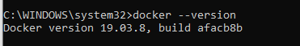

Con ello podremos verificar que se ha instalado correctamente y veremos la versión instalada.


# Servicios necesarios

Los servicios que necesitaremos para ésta prueba de concepto son el Zookepper, Kafka y Kafdrop.

## Zookepper

Consiste en un servicio cuya función es balancear la carga de trabajo.

## Kafka

Es un servicio que podría verse como un gestor de cola de mensajes, con una estructura de publicación-suscripción. Kafka es masivamente escalable, concebida como un registro de transacciones distribuidas.

## Kafdrop

Es un servicio que nos sirve para visualizar el contenido de los **topics** (colas) existentes en Kafka.


# Configuración

Deberemos tener un fichero de configuración con los servicios y configuración de estos mismos, en nuestro caso será el fichero docker-compose-extra.yml, y tendrá el siguiente contenido.


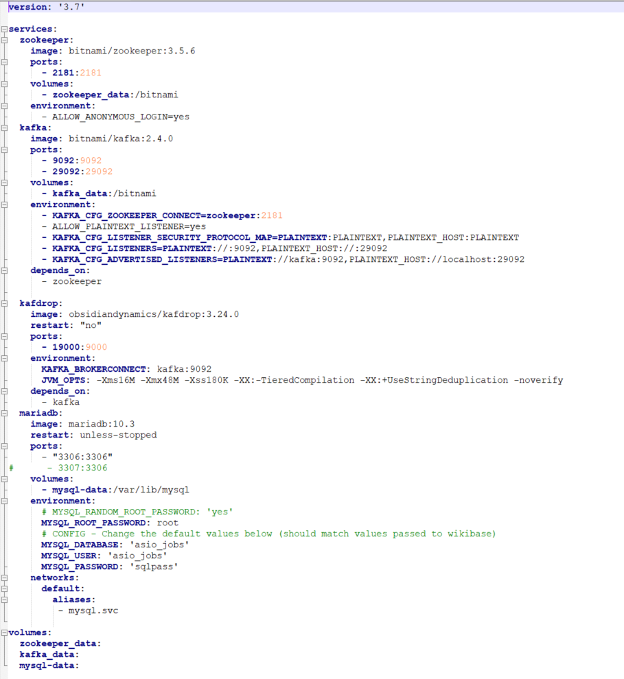


# Ejecutar Docker creado

Abriremos una consola con permiso de administrador y nos ubicaremos en la ruta dónde tengamos el fichero de configuración con extensión **YML**


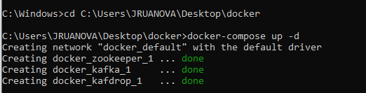


# Lista de contenedores

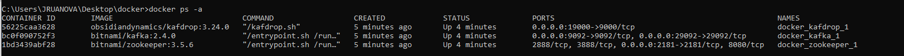


# Pentaho Data Integration

A continuación se describen los pasos necesarios para instalar y configurar Pentaho Data Integration (PDI) también llamado KETTLE:

Los requisitos básicos son:

- Edición comunitaria de integración de datos de Pentaho
- JRE 1.8 y superior (Java Runtime Environment)
- JDK 1.8 y superior (Java Development Kit)
- Windows 7 y superior (aunque PDI también se puede instalar en Linux o Mac OS, el alcance de esta publicación se limita al sistema operativo Windows)

**Paso 1: Descarga del software de integración de datos Pentaho (PDI / Kettle)**

El primer paso es descargar PDI Community Edition desde la página de descarga oficial de Sourceforge. 

**Paso 2: extracción del archivo zip**

Extraer el archivo zip descargado que estará en la carpeta Descargas. Hacer clic derecho en el archivo y elija 'Extraer aquí' si se desea que se extraiga en la carpeta de descargas.

**Paso 3: Comprobación de la versión de JRE**

El siguiente paso es verificar la versión de Java Runtime Environment en el sistema. Primero hay que verificar si la máquina tiene Java instalado. Si no, será necesario desgargarlo de la página oficial de descarga de Java.


Si ya está instalado, se verificarán las versiones de JRE. Para hacer esto,

- C: \ Archivos de programa \ Java \ (en caso de que sea un sistema operativo Windows de 32 bits)

- C: \ Archivos de programa (x86) \ Java (en el caso de un sistema operativo de 64 bits).

  

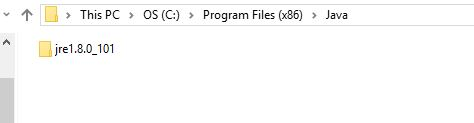


Habrá una carpeta dentro de esta ruta de carpeta, comenzando con 'jre' seguido del número de versión. Esta versión debe ser 1.8 o superior. Si este es el caso, entonces podemos continuar con el siguiente paso.


Si no se tiene JRE, necesitamos descargar la versión JRE 1.8 o superior de la página oficial de descarga de Oracle JRE e instalarla. Necesitamos descargar el archivo correcto de acuerdo con el tipo de sistema operativo (32 bits / 64 bits) y también seleccionar el archivo que termina con la extensión '.exe' ya que no requiere ninguna herramienta de extracción.


Una vez descargado el archivo, ejecutar e instalar JRE.

**Paso 4: Verificación de la versión de JDK**

El siguiente paso es verificar la versión de JDK en su PC con Windows. Este paso es similar al paso anterior.


C: \ Archivos de programa \ Java \


En la misma carpeta, habrá una carpeta con un nombre similar a 'jdk1.8.0_191'.  Si la carpeta no está allí, tenemos que descargar el JDK desde la página de descarga oficial de Oracle JDK.

Al igual que en el paso anterior, necesitamos descargar el archivo correcto de acuerdo con el tipo de arquitectura de nuestro sistema operativo (32 bits / 64 bits) y habrá varios formatos del archivo disponibles. Elegir el archivo que termina con la extensión '.exe' e instalar el JDK ejecutando el archivo después de la descarga.


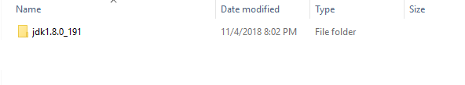

**Paso 5: Configuración de las variables de entorno**

El paso final es configurar las variables de entorno para que apunten a la ruta de la carpeta JRE.

- Abrir Mi PC (o) presione Ctrl + E.

- En el panel del lado izquierdo, hacer clic con el botón derecho en 'Equipo' para Win 7 (o) 'Esta PC' para Win 10 y seleccionar la opción 'Propiedades'.

- Aparecerá una nueva ventana que muestra el procesador, la capacidad de RAM, el nombre de la computadora, etc.

- Alternativamente, navegar a Panel de control \ Sistema y Seguridad \ Sistema puede traer la misma ventana.

- En el panel lateral izquierdo, hacer clic en 'Configuración avanzada del sistema' y aparecerá la ventana Propiedades del sistema. Ir a la pestaña 'Avanzado' y seleccionar el botón 'Variables de entorno'.

- En la ventana de Variables de entorno, hacer clic en el botón nuevo.

- Escribir 'PENTAHO_JAVA' en mayúsculas como nombre de variable y la ruta de la carpeta apuntando a java.exe en la carpeta jre como valor de variable y hacer clic en Aceptar. 

  

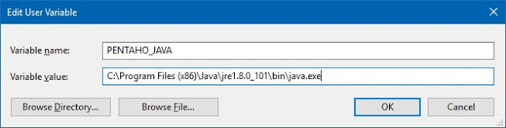


Nuevamente, crear una nueva variable de la misma manera, pero establecer el nombre de la variable como 'PENTAHO_JAVA_HOME' como nombre de variable y la ruta de la carpeta jre como valor de variable como en la captura de pantalla que se muestra a continuación.


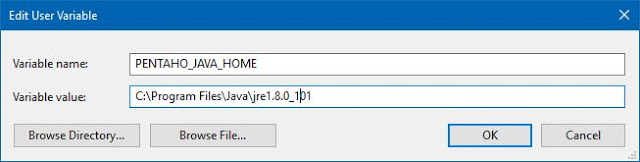


Finalmente, crear otra variable con el nombre JAVA_HOME y el valor de la variable sería la ruta donde está disponible la carpeta jdk (vea el Paso 4).


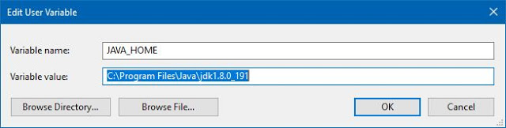


# Comprobación mensajes Kafka

Abrimos un navegador y nos dirigimos a la siguiente URL: http://localhost:19000/


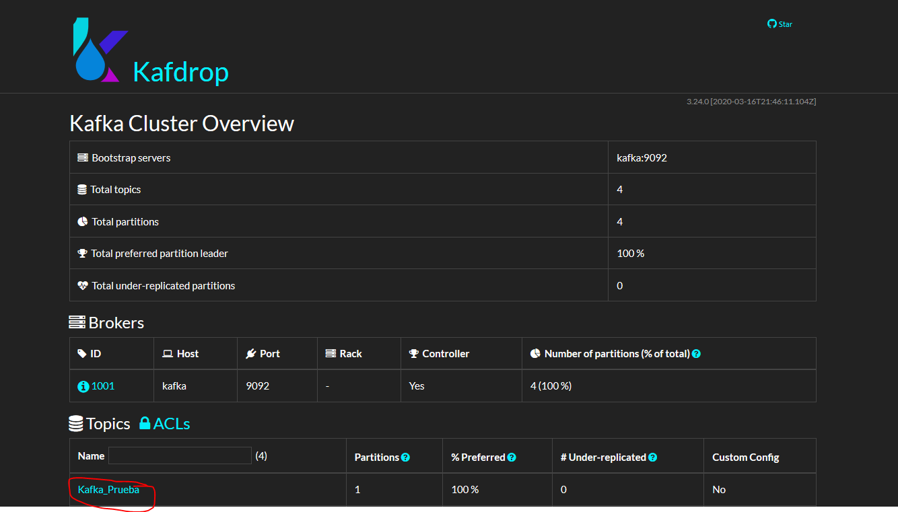

Podemos ver que se ha creado el topic Kafka_Prueba.


Accedemos al topic.

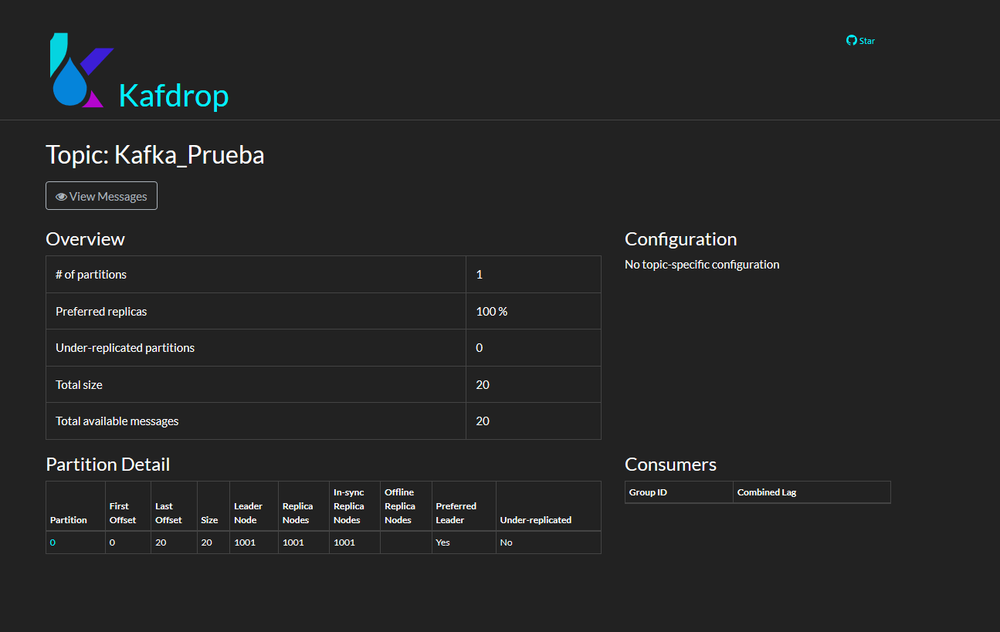


Podemos ver que la cola de mensajes tiene un tamaño de 20, que coincide con el número de registros generados por PDI.


Le damos a View Messages.


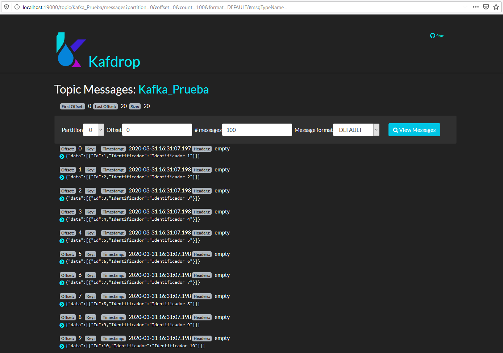


Podemos ver que los mensajes se han recibido correctamente.

Con ello finaliza la prueba de concepto y se verifica que desde PDI podemos añadir los mensajes en el kafka.


