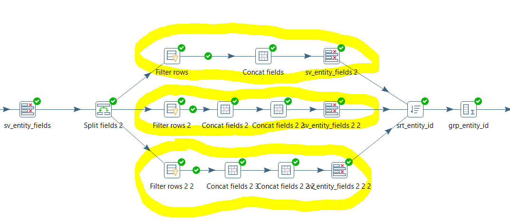

| Entregable | Proyecto ETL                                                 |
| ---------- | ------------------------------------------------------------ |
| Fecha      | 15/07/2021                                                   |
| Proyecto   | [ASIO](https://www.um.es/web/hercules/proyectos/asio) (Arquitectura Semántica e Infraestructura Ontológica) en el marco de la iniciativa [Hércules](https://www.um.es/web/hercules/) para la Semántica de Datos de Investigación de Universidades que forma parte de [CRUE-TIC](https://www.crue.org/proyecto/hercules/) |
| Módulo     | Proyecto ETL                                                 |
| Tipo       | Manual de usuario                                            |


# Objetivo

Este manual tiene como objetivo redirigir al usuario a una wiki oficial proporcionada por HITACHI con la documentación técnica de Spoon, la interfaz gráfica de Pentaho PDI.

El contenido de esta wiki cubre los aspectos técnicos que serán necesarios para mantener y escalar el ETL necesario para el proceso de importación de datos de ASIO.

Seguidamente, se mostrará un ejemplo sencillo de modificación de una transformación.

El índice con todo el contenido por temas se encuentra en el siguiente enlace:

[Manual del Usuario de Spoon](https://wiki.pentaho.com/pages/viewpage.action?pageId=12387210)


# Índice de contenidos

Este documento cubre los siguientes temas:

1. Introducción a Spoon
2. Crear una Transformación o Trabajo
3. Conexiones a Bases de Datos
4. Editor SQL
5. Explorador de Bases de Datos
6. Saltos
7. Variables
8. Configuración de Transformaciones
9. Pasos de Transformaciones
10. Configuración de Trabajos
11. Entradas de Trabajos
12. Vista Gráfica
13. Ejecutar una Transformación o Trabajo
14. Logs
15. Grillas
16. Catálogo
17. Objetos Compartidos
18. Apéndice: Licencia LGPL


# Ejemplo de modificación en ETL

## Acceso al proyecto con Spoon

Primeramente será necesario acceder al entorno PDI para poder modificar el ETL. Existen dos posibles formas de llevar a cabo esta acción:

1. Trabajar en un entorno local con una versión de Pentaho PDI instalada y configurada (ver Manual Despliegue)
2. Trabajar en un entorno web.

**NOTA: el acceso web solo permite la edición del ETL, pero no permite su ejecución**

Se puede acceder al interface Web de Spoon, a partir del propio frontal, desplegado en:

* Entorno de desarrollo: https://linkeddata1.um.es/

* Entorno de preproducción: https://linkeddata1desa.um.es/

Para poder visualizar la opción ETL, es necesario realizar el proceso de login en el portal con el rol de administrador.

Una vez logados podemos pulsar la opción del menú ETL o el icono ETL, disponible en el home


Tras esto veremos la interface Web de Spoon


Podemos acceder a cualquier Job o transformación en la opción del menú **file  > open**, tras lo cual un asistente nos permitirá navegar a traves de la estructura de directorios, definida para este proyecto


Seleccionando uno de los Jobs o Transformaciones visualizarlo y editar el propio Job o cualquiera de sus componentes, de la misma manera que podríamos hacerlo a partir de la instalación en un entorno local


Es conveniente aclarar que en caso de editar mediante el uso del entorno web, el servicio de Spoon comparte ficheros de definición de ETL, con el proceso PDI que las ejecuta, por lo tanto, el simple hecho de realizar un cambio mediante esta interface, hace que los ficheros necesarios para su ejecución se actualicen automáticamente en el proceso PDI, es decir cualquier cambio que realicemos y salvemos mediante la interface web, se propaga de forma automática hacia el proceso PDI. Esto obviamente no sucede con una instalación manual, donde será necesario copiar los ficheros creados o cambiados al proceso PDI, tal y como se explica en el apartado [Desplegar Cambios](#Desplegar-Cambios).


## Modificación

A continuación se muestra un ejemplo de modificación de una transformación existente. Usaremos la transformación "Person" que se encarga de cargar los datos de la entidad Persona. El cambio consiste en modificar el campo "nombre" compuesto por nombre+apellidos y separarlo en dos campos independientes.

1. Abrir Pentaho PDI y conectarse/crear un repositorio de tipo fichero que apunte a la carpeta raíz que contiene el proyecto de ETL


2. Abrir la transformación que contiene la carga de la entidad "Persona", para ello hay que hacer clik en el botón abrir archivo y navegar hasta la carpeta que contiene los archivos de tipo transformación "5.transformations". Una vez dentro, buscar el archivo 5.1.9_load_plain_person


3. Acceder al primer "step" para previsualizar los datos de entrada. Este paso se conecta directamente al origen de datos Persona. (Para editar el nombre de este origen, debemos hacer click con el botón derecho en cualquier punto del lienzo de la transformación y clicar en la opción "Properties", después entrar en la pestaña Parameters donde se podrá editar manualmente el contenido de la variable que almacena el nombre del orígen de datos. Esta función es común a cualquier transformación).


4. En el menú de la izquierda, dentro de la pestaña "Design", buscaremos un step que se llama por defecto "split fields", seleccionamos y arrastramos con el ratón a la pantalla de la transformación. Volvemos a seleccionarlo y lo arrastraremos justo encima del conector a continuación del paso "sv_entity_fields". Debemos comprobar que este nuevo paso se ha conectado al flujo de la transformación.


5. Haciendo click con el botón derecho sobre el paso, "edit" entramos en la edición del paso. Elegimos el campo que contiene el nombre, el delimitador (espacio) y los campos resultantes tras la división (firstname y lastname)


6. Editamos el step grp_entity_id, que hace un "group by" para incluir los nuevos campos creados.


7. Editamos el paso "jsono_pojo" y dentro de la pestaña Fields editamos dos de los elementos, "firstname" y "surname", la columna de la izquierda (Fieldname) permitirá elegir el campo del flujo ETL que contiene el valor, mientras que la columna de la derecha "Element name" permite darle un nombre a la propiedad (Nota: los nombres de las propiedades provienen de la ontología)


El ejemplo anterior se podría hacer de una forma alternativa, más rigurosa, en donde se distinga si el nombre es compuesto, o bien alguno de los apellidos consta de dos palabras. En ese caso, se podría utilizar el paso "split fields" y dividir el campo nombre en cinco campos independientes. 




Posteriormente, mediante el paso "Filter rows" es posible dividir el flujo de datos en múltiples flujos usando condicionales, de esta forma podemos componer los nuevos campos "nombre" y "apellidos" atendiendo al número de palabras que lo conforman:


Finalmente, se concatenan los campos correspondientes con el paso "Concat fields":


## Desplegar cambios

Finalmente y una vez que se han realizado los cambios y las pruebas pertinentes para asegurar que el flujo de datos es correcto y la ejecución del proceso de ETL es satisfactoria, se debe desplegar el proyecto nuevamente para que la próxima ejecución en el entorno de producción se realice con la nueva versión del proyecto.

Los pasos necesarios para hacerlo, dependen del tipo de Aplicación Spoon usada para editarlos.

### Spoon local

En este caso los cambios son locales y hay que copiarlos en la carpeta usada por el proceso pdi, encargado de ejecutar el proceso de transformación de datos.

Para ello, existe (o deberá de crearse en caso de no existir) en cada una de las maquinas back desplegadas para el proyecto, la carpeta **asio-um** en la siguiente ruta **/home/herculesizertis/pdi/repositories**

Simplemente, tendremos que copiar los ficheros cambiados o creador para el nuevo proceso de ETL, en dicha ruta, siguiendo una estructura parecida a la de la imagen (project_diamesaño)


### Spoon Web

En este caso, cualquier cambio que se haga a traves del frontal web (después de su guardado a traves de la interface), es propagado directamente al servicio pdi que ejecuta el proceso de etl, ya que ambos comparten el mismo volumen docker, esto implica que cualquier cambio efectuado en un servicio, es inmediatamente visible en el otro.

### Recarga de datos en el proceso PDI

Ante cualquier cambio realizado en los ficheros de definición de Jobs o Transformaciones, ya sea mediante el Spoon local o el Spoon Web, es necesario reiniciar el servicio pdi, ya que de otra forma seguirá trabajando con los ficheros en memoria, y no se vera afectado por el cambio.

Para ello, es necesario trabajar desde la maquina de back (en el entorno afectado), y posicionarse en la ruta **/home/herculesizertis/deploy**

```bash
cd /home/herculesizertis/deploy
```

Y forzar la recargarga el sercvicio pdi, 

```bash
docker-compose restart pdi
```

