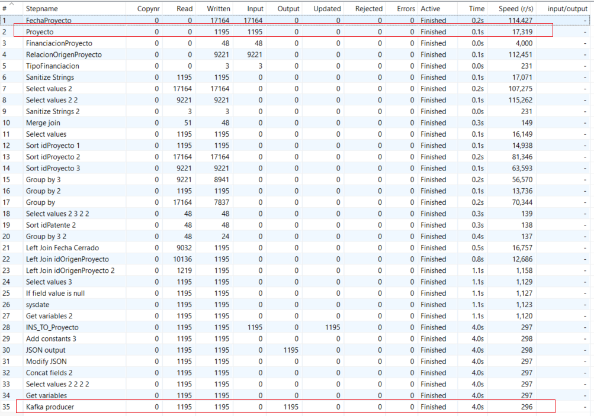
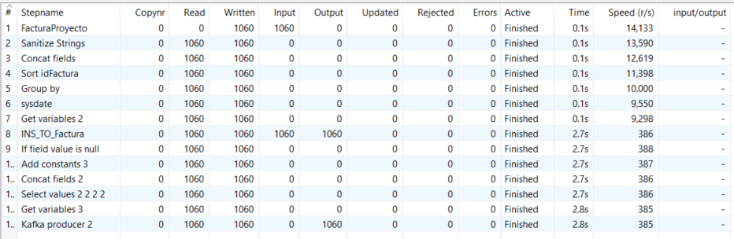
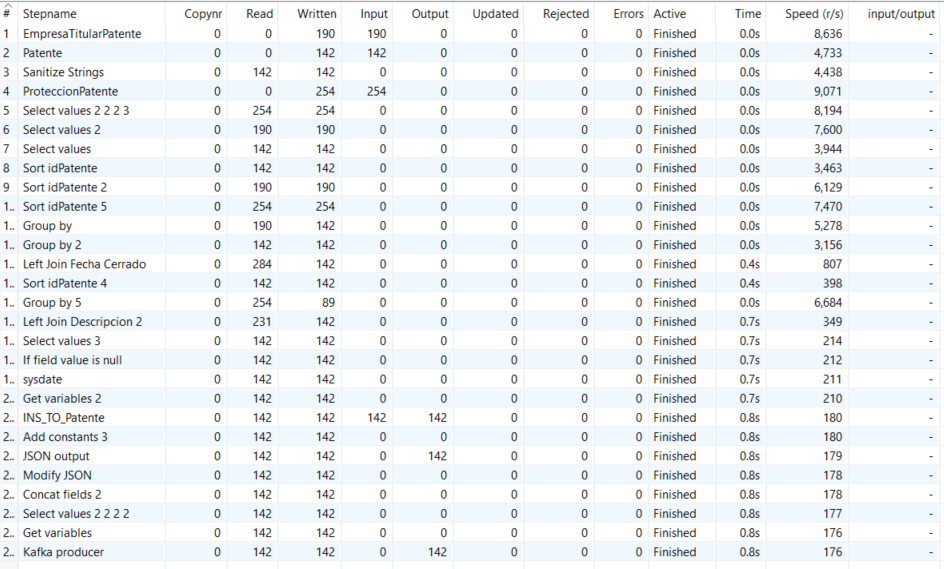
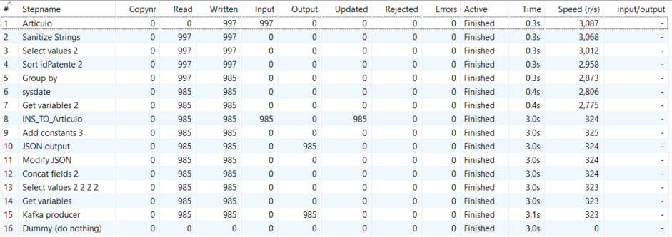
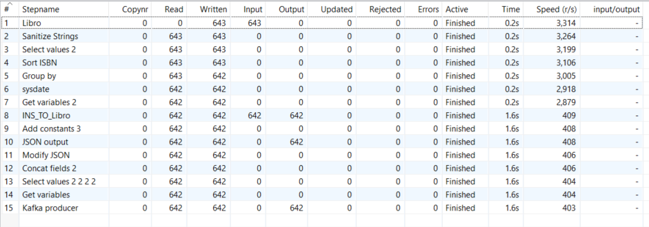
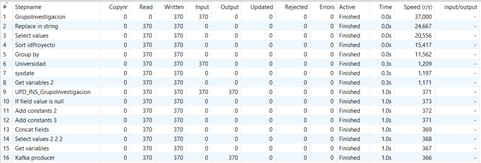
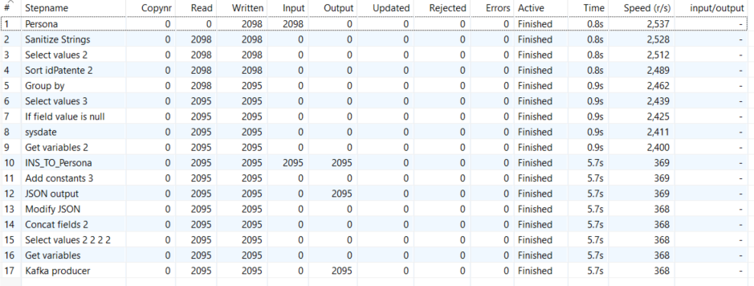

| Entregable | Proyecto ETL                                                 |
| ---------- | ------------------------------------------------------------ |
| Fecha      | 17/12/2020                                                   |
| Proyecto   | [ASIO](https://www.um.es/web/hercules/proyectos/asio) (Arquitectura Semántica e Infraestructura Ontológica) en el marco de la iniciativa [Hércules](https://www.um.es/web/hercules/) para la Semántica de Datos de Investigación de Universidades que forma parte de [CRUE-TIC](https://www.crue.org/proyecto/hercules/) |
| Módulo     | Proyecto ETL                                                 |
| Tipo       | Pruebas y validaciones                                       |

# Pruebas
## Pruebas de lectura y carga de datos para entidades sin relación

El objetivo de estas pruebas es comprobar y validar que la lectura de datos desde los orígenes coincide con la carga de datos en el destino y en caso contrario justificar la causa.

**Entidad Proyecto:**

- Registros IN: 1195
- Registros OUT: 1195

**Entidad Factura:**

- Registros IN: 1060
- Registros OUT: 1060

Entidad Patente:

- Registros IN: 142
- Registros OUT: 142

**Entidad Artículo:**

- Registros IN: 997
- Registros OUT: 985 (eliminación de registros duplicados)

**Entidad Libro:**

- Registros IN: 643
- Registros OUT: 642 (eliminación de registros duplicados)

**Entidad GrupoInvestigacion:**

- Registros IN: 370
- Registros OUT: 370

**Entidad Persona:**

- Registros IN: 2098
- Registros OUT: 2095 (eliminación de registros duplicados)

